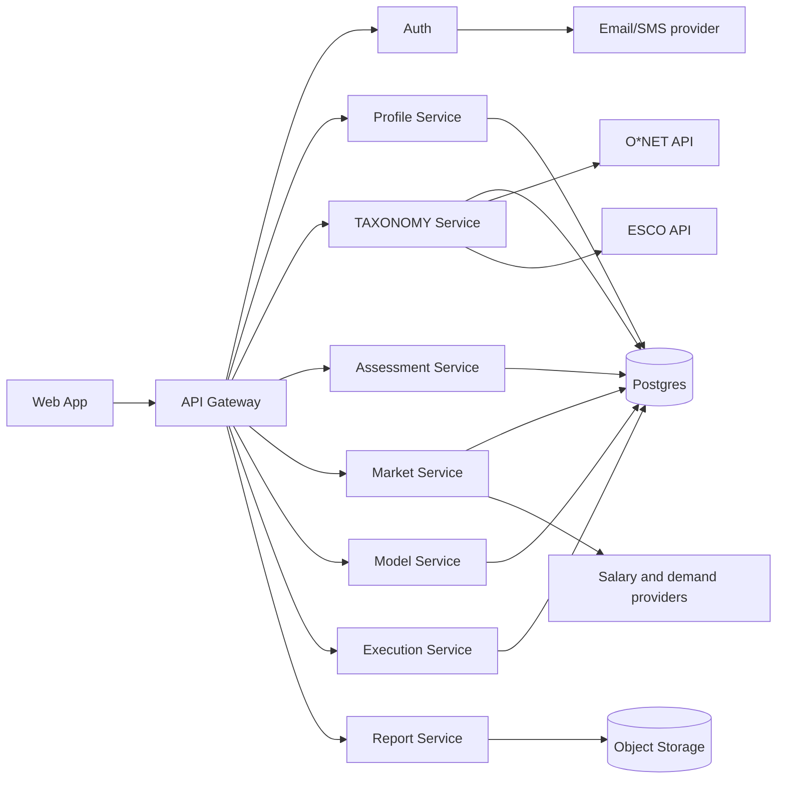

# AI Career Path OS Architecture Specification

Version: 1.0  
Date: 2026-02-18  
Owner: Engineering + Data + AI

## 1. Architecture Goals

- Build an evidence-first career intelligence platform.
- Keep scoring explainable and auditable.
- Support fast MVP delivery without dead-end structure.
- Isolate taxonomy and market dependencies behind adapters.
- Separate model scoring logic from narrative generation.

## 2. High-Level System Topology

## 3. MVP Service Boundaries

## 3.1 `api-gateway`

Responsibilities:
- Authentication enforcement.
- Routing and request validation.
- Rate limiting and audit logging.

Key routes (examples):
- Auth and profile endpoints.
- Assessment lifecycle endpoints.
- Blueprint generation/fetch/export.
- Check-in endpoint.

## 3.2 `profile-service`

Responsibilities:
- Resume ingestion and parsing orchestration.
- Structured timeline normalization.
- Deep CV metric computation.

Outputs:
- Resume timeline records.
- Layer 1 CV intelligence signals.

## 3.3 `taxonomy-service`

Responsibilities:
- Canonical role and skill mapping.
- Adapter integrations for O*NET and ESCO.
- Cache and version control of taxonomy mapping tables.

Outputs:
- Canonical role IDs.
- Skill and role adjacency lookup.

## 3.4 `assessment-service`

Responsibilities:
- Serve micro-tests and simulations.
- Ingest event streams.
- Score attempts with rubrics and reliability estimation.

Outputs:
- Assessment result payloads.
- Evidence items with strength and reliability.

## 3.5 `market-service`

Responsibilities:
- Ingest market demand and compensation feeds.
- Normalize by taxonomy IDs, region, seniority.
- Publish market snapshots for model engine.

Outputs:
- Demand, salary, premium, saturation, automation proxies.

## 3.6 `model-service`

Responsibilities:
- Compute CIS, confidence, and scenario forecasts.
- Rank drivers and risk factors.
- Produce mission recommendations.

Inputs:
- CV intelligence.
- Assessment evidence.
- Motivation vectors.
- Market snapshot.

Outputs:
- Blueprint JSON.
- Explanation artifact.

## 3.7 `report-service`

Responsibilities:
- Render report templates.
- Convert HTML to PDF.
- Store export artifacts and signed URLs.

Outputs:
- Downloadable report assets.

## 3.8 `execution-service`

Responsibilities:
- Persist mission plans.
- Handle weekly check-ins.
- Compute drift alerts and refresh recommendations.

Outputs:
- Next mission set.
- Drift and alignment alerts.

## 4. Data Stores

Primary (MVP):
- Postgres:
  - users, profiles, resume_items, assessments, assessment_attempts, evidence_items, market_signals, roadmaps, missions, checkins.

Binary/object data:
- Object storage:
  - Uploaded resumes.
  - Exported PDFs.

Optional future:
- Graph storage (Neo4j or Postgres edge tables) for capability graph traversal.
- pgvector for retrieval and role/skill similarity features.

## 5. Backend AI Pipeline

## 5.1 Ingestion and Normalization

Steps:
1. Parse resume into structured entries.
2. Normalize titles and entities.
3. Map roles/skills to taxonomy IDs via O*NET/ESCO adapters.
4. Persist candidate mappings and mapping confidence.
5. Save correction feedback for mapper improvement.

## 5.2 Deep CV Intelligence (Layer 1)

Computed features:
- Career velocity.
- Role complexity growth proxy.
- Transition patterns across function/industry.
- Contextual risk patterns.

Derived outputs:
- Career Maturity Score.
- Adaptability Index.
- Skill Compounding Potential.
- Feature-level explanation and confidence.

## 5.3 Skill Evidence Engine (Layer 2)

Flow:
1. Adaptive test item selection.
2. Event stream capture (time, revisions, decisions).
3. Rubric scoring and subscore generation.
4. Reliability estimation.
5. Evidence item emission with recency and reliability weights.

## 5.4 Behavioral and Cognitive Engine (Layer 3, v1+)

Outputs trait vector:
- Ambiguity tolerance.
- Risk orientation.
- Strategic/tactical bias.
- Persistence.
- Social/analytical orientation.

Store as Work Style Genome profile.

## 5.5 Motivation Engine (Layer 4)

Inputs:
- Preference surveys.
- Weekly check-in trend signals.

Outputs:
- MotivationFit vector.
- Energy mismatch flags.

## 5.6 Market Intelligence Engine (Layer 5)

Per role cluster and skill:
- Demand index.
- Salary distribution and trend.
- Skill premium proxy.
- Saturation proxy.
- Automation exposure proxy.

All keyed by canonical taxonomy IDs for join consistency.

## 5.7 Scoring and Scenario Engine

Core per-cluster scoring:
- SkillFit.
- BehaviorFit.
- MotivationFit.
- MarketScore.

Composite outputs:
- CIS mean and confidence interval.
- Top drivers and top risks.
- Safe, aggressive, pivot scenarios.

Scenario output fields:
- Time-to-transition range.
- 3-year earnings range.
- Risk deltas.
- Mission implications.

## 5.8 Output Generation

Artifacts:
- Blueprint JSON.
- PDF report.
- Dashboard cards.
- Mission list.
- Explanation artifact for auditability.

## 6. Runtime Agent Architecture

These are internal workers and not end-user chatbots.

## 6.1 Profile Analyst Agent

Responsibilities:
- QA role extraction and mappings.
- Flag low-confidence fields.
- Generate confirmation prompts.

## 6.2 Assessment Designer Agent (internal tooling)

Responsibilities:
- Assist authoring new assessment items.
- Propose rubric templates and scoring configs.

## 6.3 Career Strategist Agent

Responsibilities:
- Draft scenario narrative and mission text.
- Must stay constrained to scored outputs.

## 6.4 Risk and Compliance Agent

Responsibilities:
- Verify uncertainty and confidence are exposed.
- Block disallowed deterministic claims.

## 6.5 Execution Coach Agent

Responsibilities:
- Generate weekly nudges.
- Detect drift from check-in trajectories.

## 6.6 Agent Orchestration Pattern

Recommended pattern:
- Orchestrator receives event.
- Specialist agent handoff sequence executes.
- Trace emitted for observability.
- Only validated outputs are published to user-visible surfaces.

## 7. External Integrations

Required:
- O*NET Web Services.
- ESCO Web Service.
- Email/SMS provider for magic links and reminders.

Configurable provider interfaces:
- Market demand data feed adapter.
- Salary feed adapter.

Future optional:
- Calendar integration for check-in reminders.

## 8. Security and Privacy Architecture

- Encrypt data in transit and at rest.
- Separate PII access paths from analytics queries.
- Use signed URLs for file upload/download.
- Store explicit consent versions and timestamps.
- Support data export and deletion workflows.

## 9. Reliability and Performance

MVP targets:
- p95 API latency under 600ms for non-report endpoints.
- p95 blueprint generation under 10s for cached market snapshot path.
- Report export under 15s for typical profile size.

Resilience:
- Retries with idempotency keys for event ingestion.
- Circuit breakers for external taxonomy and market adapters.
- Dead-letter queue for failed ingest jobs.

## 10. Deployment Strategy

MVP deployment model:
- Modular monolith runtime with clear service modules.
- Shared Postgres schema with service-owned table boundaries.
- Background workers for asynchronous tasks.

Extraction plan:
- First extraction candidate: taxonomy-service.
- Second extraction candidate: market-service.
- Third extraction candidate: report-service.

## 11. Engineering Acceptance Criteria

Architecture implementation is accepted when:
- Every MVP route maps to a service owner.
- Taxonomy mapping calls are adapter-isolated.
- Evidence items persist with reliability metadata.
- Blueprint output includes confidence, drivers, and risks.
- Explanation artifact is persisted for each blueprint.
- Check-in loop can produce drift alerts and next missions.
- PDF export path is functional and traceable.
